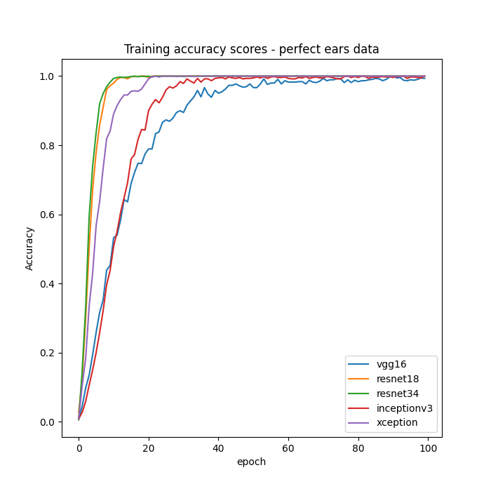
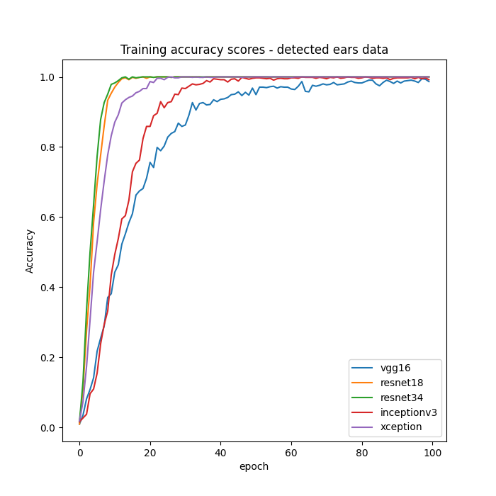
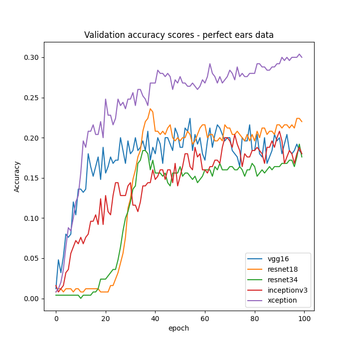
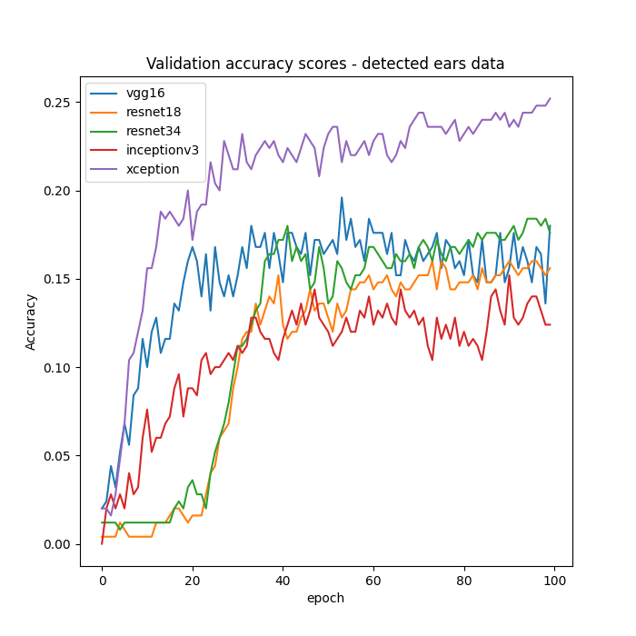
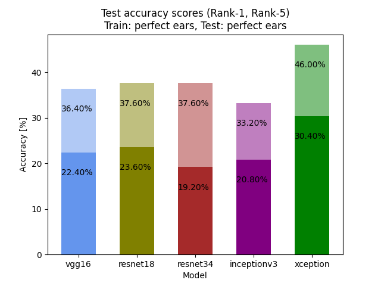
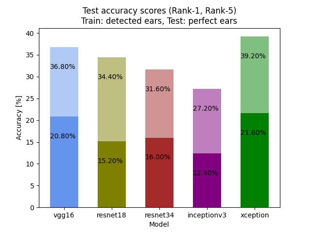
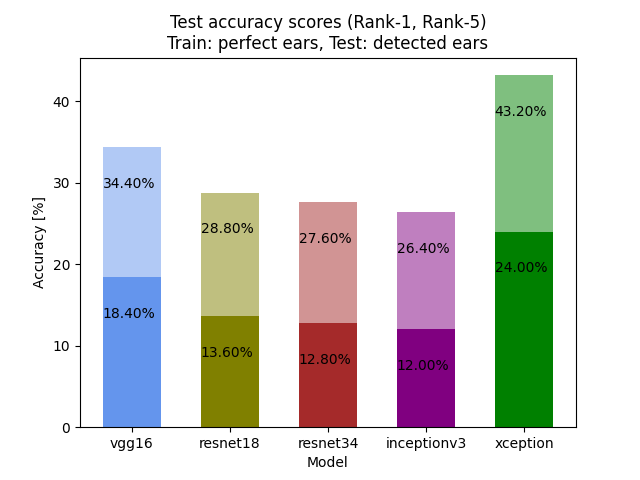
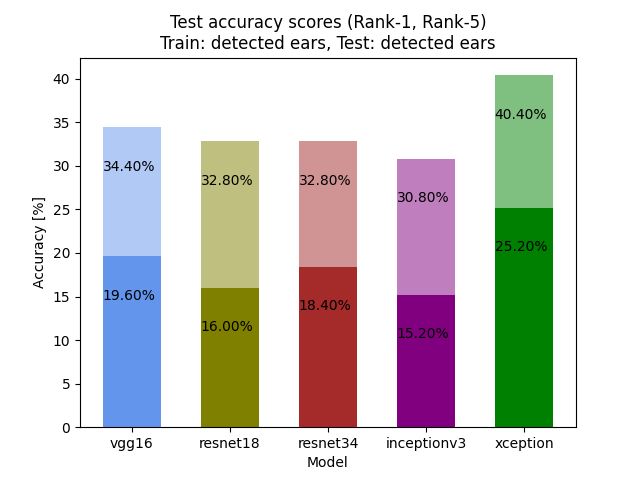

# Recognition results

## Models
- VGG16
- ResNet18
- ResNet34
- InceptionV3
- Xception

## Datasets
Perfect ears:
- 750 - training, 250 - validation/test (because of small dataset used the same for both)
- cropped perfectly

Detected ears:
- 750 - training, 250 - validation/test
- output of detection model (yolov4)

100 classes (people - ears owners)
All images scaled to (96, 96) size.
Batches of size 25.

## Training
Used transfer learning on models pre-trained on popular _imagenet_ dataset. As the top layer of each one, dense softmax layer with 100 (=number of classes) units was used.
- 100 epochs
- learning rate: 0.0001
- categorical cross-entropy loss
- accuracy

### Data augmentation
Applied to training dataset only with randomly applied transformations:
- shear range: (-0.2, 0.2)
- zoom range: (0.9, 1.1)
- brightness range: (0.3, 0.7)
- horizontal fliping

### Accuracy on train dataset
| Perfect | Detected |
|:-------:|:---------:|
| |  |

### Accuracy on validation dataset
| Perfect | Detected |
|:-------:|:---------:|
| |  |

## Evaluation
- Rank-1 accuracy
- Rank-5 accuracy

Evaluated models trained on perfect ears dataset, on both perfect and detected test datasets, and vice versa.

|         | Perfect | Detected |
|:-------:|:--------------------------------------:|:---------------------------------------:|
| Perfect |   |   |
| Detected|  |  |

Xception found to be the best performing. InceptionV3 achieved the worst scores. Interestingly, VGG16 and ResNets were performing similarly and in different order, depending on evaluation configuration.
