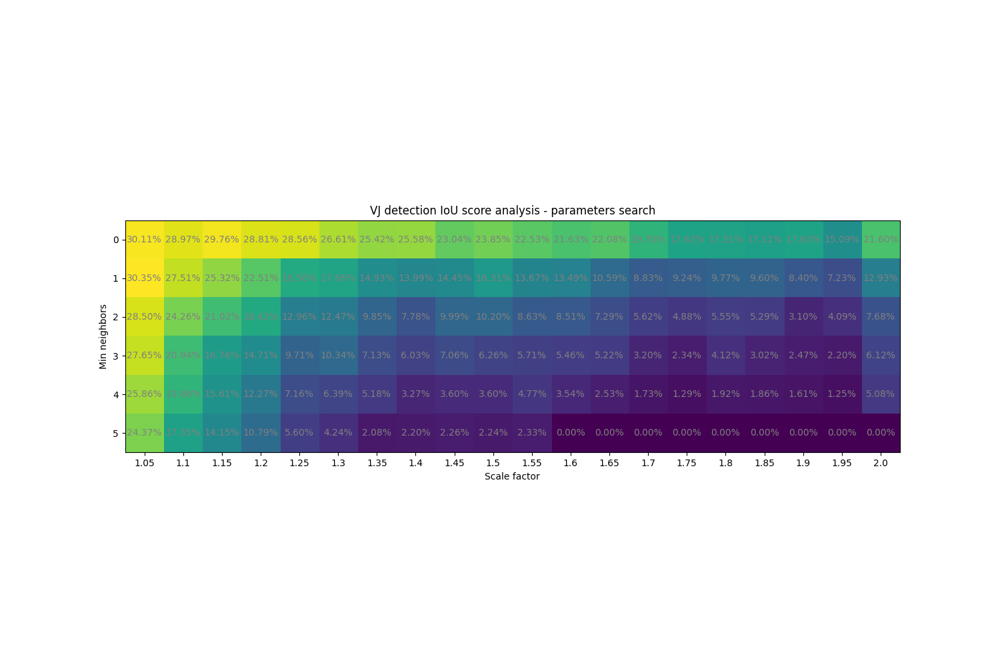
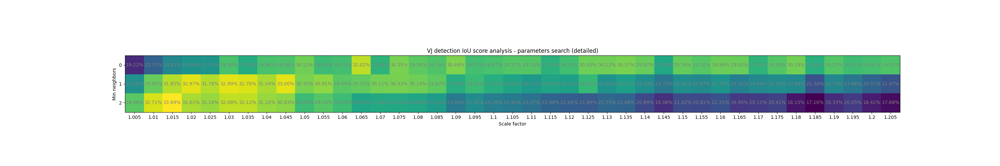
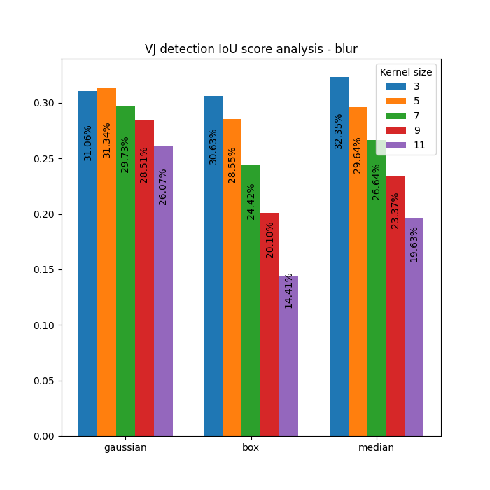

# Ear detection results

## Cascade detector (Viola-Jones)
### Parameters search

Best parameters:
- scale_factor = 1.015
- min_neighbor = 2

Best IoU: 33.69%

### Data preprocessing impact on results analysis
1. Blur

Types: Gaussian, box filter and median
Kernel sizes: 3, 5, 7, 9, 11

Best: 32.35% (Median, 3)

2. Contrast & brightness

*new_px = alpha * px + beta*

Best: 34.66% (alpha: 0.75, beta: -10)

3. Scaling

Scaled to *360x360*: 3.02%
Scaled to *480x480*: 5.48%

## CNN (with YOLOv4)

- Run for 2000 epochs, tested using weights with best validation score during training.
- Rescaled images to *416x416* square - being a first CNN layer size

Analysed 3 version varying in data augmentation (*saturation, exposure, hue, blur):

| Saturation | Exposure |  Hue | Blur | *Comment* |    IoU   |
|:----------:|:--------:|:----:|:----:|:---------:|:--------:|
|     1.5    |    1.5   |  0.1 |  NA  | *default* |**76.46%**|
|      3     |     3    |  0.2 |   1  |           |  75.88%  |
|    0.75    |   0.75   | 0.05 |  NA  |           |  71.83%  |

